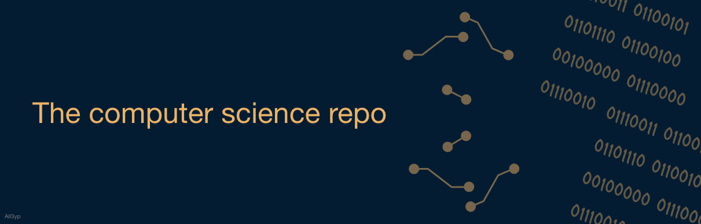

 

#### O objetivo deste repositório é reunir todos os projetos open source de ciências da computação
 

  <a href="#cursos">🎓 Cursos</a>
  &nbsp;&nbsp;&nbsp;|&nbsp;&nbsp;&nbsp;
  <a href="#livros">📚 Livros</a>
  &nbsp;&nbsp;&nbsp;|&nbsp;&nbsp;&nbsp;
  <a href="#roadmaps">📌 Roadmaps</a>
  &nbsp;&nbsp;&nbsp;|&nbsp;&nbsp;&nbsp;
  <a href="#extras">📚 Extras</a>
    &nbsp;&nbsp;&nbsp;|&nbsp;&nbsp;&nbsp;
  <a href="#contribuir">👥 Como contribuir</a>

 

> ＂What ultimately matters in this course is not so much where you end up relative to your classmates but where you end up relative to yourself when you began＂- [David J. Malan](https://cs.harvard.edu/malan/)
> 
 

## 🎓Cursos

### Graduação open source em ciências da computação

- [OSSU Website](https://lnkd.in/dU_fhqWJ)
- [Universidade Livre](https://github.com/Universidade-Livre/ciencia-da-computacao#)
- [BSinCS Spreadsheet](https://lnkd.in/dvVfeSav)
- [Open Source CS Degree](https://lnkd.in/d524thU7)
- [Teach Yourself CS](https://lnkd.in/dgUKjWzi)
- [Functional CS](https://lnkd.in/dx5HsZgy)
- [Awesome CS Courses](https://github.com/prakhar1989/awesome-courses)
- [The Python Open Source Computer Science Degree](https://github.com/ForrestKnight/open-source-cs-python)
- [Open Source CS](https://github.com/ForrestKnight/open-source-cs)
- [Guia de Autoestudo para Ciência da Computação](https://compvidareal.com.br/computacao-online/)
- [MIT The Missing Semester of Your CS Education](https://missing.csail.mit.edu/)

## 📚 Livros

- [Most influential books on Computer Science/programming](https://github.com/cs-books/influential-cs-books)

## 💻 Introdução a Programação
- [Introdução a Algoritmos - Guanabara - Curso em Vídeo](https://www.youtube.com/watch?v=8mei6uVttho&list=PLHz_AreHm4dmSj0MHol_aoNYCSGFqvfXV)
- [Projetos de Algoritmos em C - Paulo Feofiloff - IME/USP](https://www.ime.usp.br/~pf/algoritmos/index.html)

## 📌 Roadmaps
- [Passo a passo para carreira Front, Back e Devops](https://roadmap.sh/)
- [Personal Roadmap based on roadmap.sh - by Raphael](https://github.com/rapdos-s/my-roadmap)
- [Developer Roadmaps](https://roadmap.sh/)
- [Computer science study](https://github.com/iaurg/Computer-Science-Study)
- [Guia de estudos - ios](https://github.com/thyagoraphael/guia-de-estudos-iOS)
- [Codando Apple](https://github.com/CodandoApple/aprenda-swift)
- [Guia Extenso de Programação](https://github.com/arthurspk/guiadevbrasil)
- [Awesome Quality Assurance Roadmap](https://github.com/fityanos/awesome-quality-assurance-roadmap)

## 📚 Extras
- [Introdução a linha de comando](https://tutorial.djangogirls.org/pt/intro_to_command_line/)
- [Guia extenso de programação](https://github.com/arthurspk/guiadevbrasil)

## 🧑‍💻 Interviews
- [Code Interview University](https://github.com/jwasham/coding-interview-university)
- [iOS interviews](https://github.com/Viniciuscarvalho/ios_interview.git)

## 👥 Como contribuir

Para contribuir com este projeto, verifique o arquivo [CONTRIBUTING.md](https://github.com/All3yp/The-computer-science-repository/blob/main/CONTRIBUTING.md)
